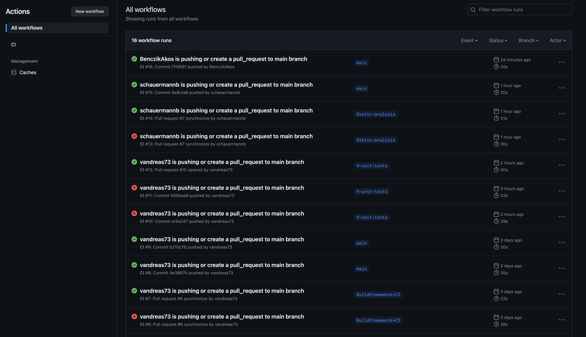
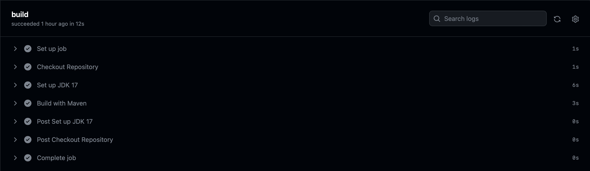
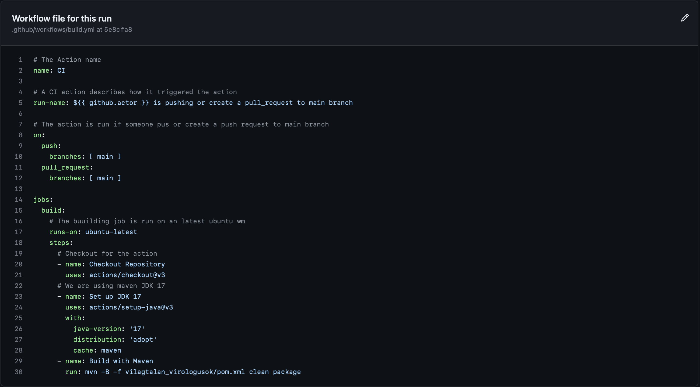

# CI commissioning with GitHub Actions

### Summary

I create the build.yml file in .github/workflows folder. 
In this file I define a build Action witch is triggered when 
someone push or create a pull request to the main branch.

### Details of the Action 

- The name of the Action is "CI"
- Every run the title is titled with te actor name
- The Action is triggered when someone push or create a pull request to the main branch
- The Action is build the project
- The project building is on a vm witch hase the latest ubuntu os
- First one the run is checked out the main repository for the build
- For second step set up the jdk 17 which is what we are using in this project 
- I set the Maven also because we are use Maven
- Then I just give the command witch is run on the ubuntu and build the project
  - I give the parameter for the build (pom.xml)
  - I set here also that the run is clean the builded files and create the new in the result folder

### Some own thought

I very liked this task. I find good documentations and i understand the mechanism. 
I see how powerful it is. And it seems really spectacular. 
It is comforting when I push and then become the green check icon.

### Some overview picture

