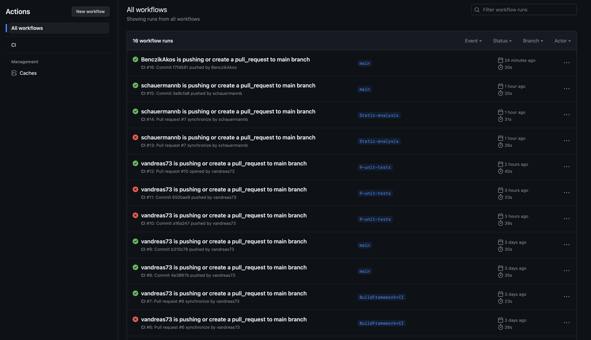
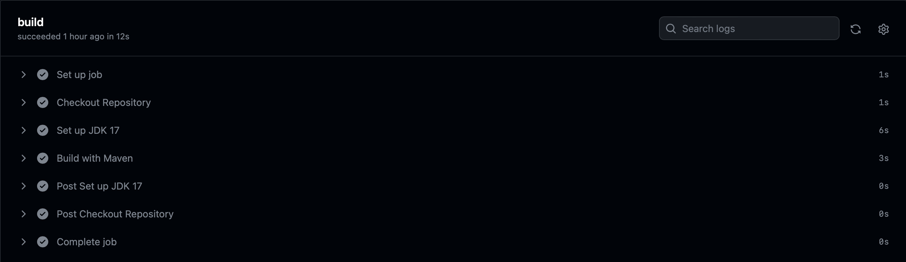
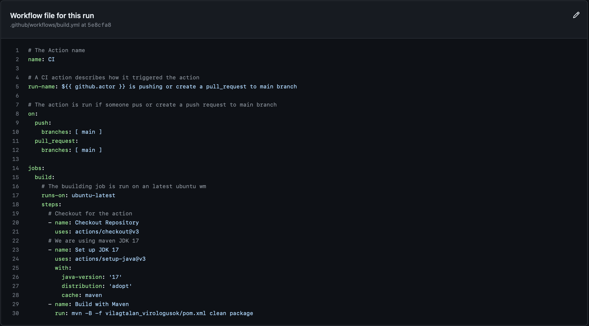

# CI üzembe helyezés a GitHub Actions segítségével

### Összefoglaló

A build.yml fájlt a .github/workflows mappában hozom létre. 
Ebben a fájlban definiáltam egy build Action-t, amely akkor lép működésbe, ha 
valaki pushol vagy pull requestet hoz létre a fő ágra.

### A művelet részletei 

- A action neve "CI"
- Minden futtatáskor a cím a futtatást kiváltó nevével van megcímezve.
- Az Action akkor indul el, amikor valaki pushol vagy pull requestet vagy hoz létre a fő ágra.
- A művelet a projektet építi
- A projekt építése egy vm-en történik, amin a legújabb ubuntu operációs rendszer van.
- Először a main repositoryt kicsekkolja az action a build számára
- A második lépés a jdk 17 beállítása, amit ebben a projektben használunk. 
- Beállítottam a Maven-t is, mert a Maven-t használjuk.
- Aztán csak megadom a parancsot ami fut az ubuntun és buildeli a projektet
  - Megadom a paramétert a buildhez (pom.xml)
  - Itt is beállítom, hogy a futtatás megtisztítja a felépített fájlokat és létrehozza az újakat a result mappában.

### Néhány saját gondolat

Nagyon tetszett ez a feladat. Jó dokumentációkat találtam, és megértettem a mechanizmust. 
Látom, hogy milyen erős ez a lehetőség. És nagyon látványosnak tűnik. 
Megnyugtató, amikor buildel a gitten a projekt és megjelenik a zöld pipa.

### Néhány áttekintő kép

Translated with www.DeepL.com/Translator (free version)

