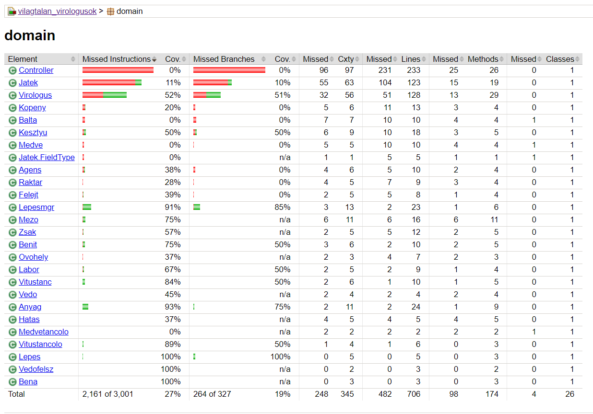
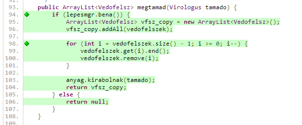

# Unit tesztek
A unit tesztek készítéséhez JUnitot használtam, mockolásra Mociktót. Javában még nem használtam mockolást, jó volt ezt is kipróbálni.<br>
A projektben relatíve kevés kód jól tesztelhető, mivel sok függvény nem ad tesztelhető visszajelzést a futásáról. Már a tervezésnél figyelembe kell venni, hogy tesztelhető legyen a kód.
# Code coverage
A coverage készítést az ```mvn clean install``` után kiadott```mvn jacoco:report``` paranccsal lehet lefuttatni. Ezután a target/site/jacoco/index.html-t megnyitva látható a lefedettség:

A lefedettséget fájlonként is lehet vizsgálni a fájlok nevére kattintva:
